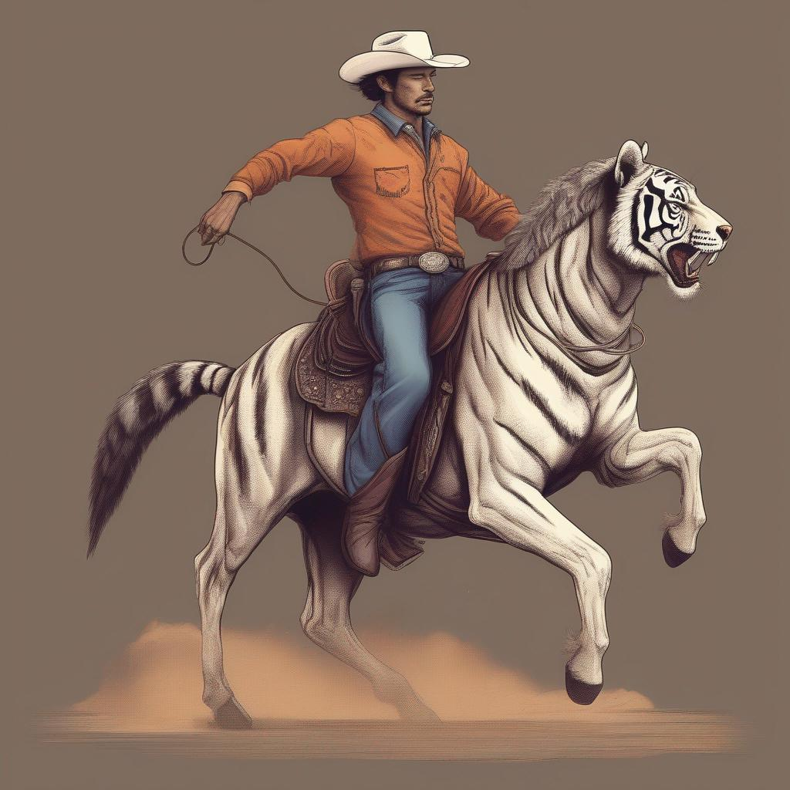
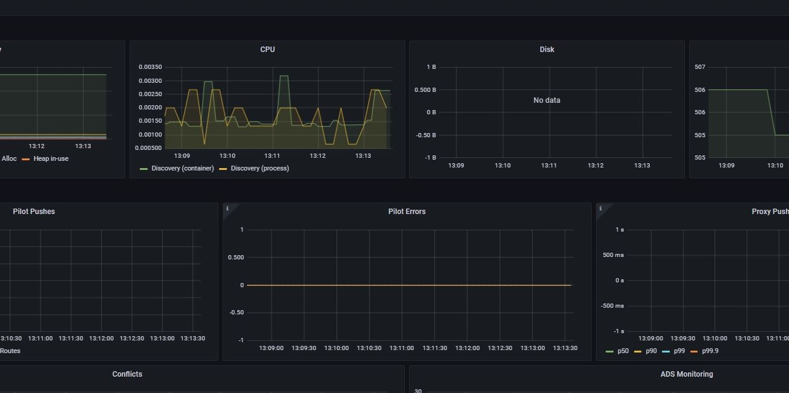
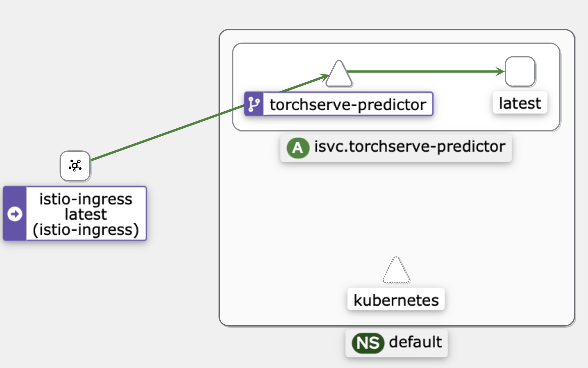

# Stable Diffusion XL deployment on Kserve (EMLO assignment 19)
This project focuses on deploying Stable Diffusion XL model on KServe serving in EKS cluster. This project is a part of EMLO assignment.

## Introduction
This project uses Kserve to create a mar file of SDXL model and deploy a serving on EKS cluster. Here we will create a mar file setup EKS cluster and will install Kserve. We will be using certain addons like grafana to monitor our serving.

## Prerequisite
Following are the required setup to recreate this project:
- kubectl, AWS CLI and eksctl needs to be installed on the system.
- AWS should be configured with required IAM role.
- make should be installed to utilize Makefile commands.
- Helm needs to be installed.

## Steps to setup Stable Diffusion XL Kserving on Kubernates
NOTE:- All steps are implemented using Makefile, to know more please checkout `Makefile` of this repo

#### 1. Create `.mar` file for Stable Diffusion XL model (SDXL)
1. Create python environment to install diffuser library(not required if creating on GPU instance).Run following command:
    - `python -m venv env`
    - `source env/bin/activate`
    - `pip install -r torchserver_marfile/requirements.txt`. 
2. Use make command to download model and create mar file. Run `make build-mar`. This will run following command:
    - Download SDXL model from diffuser library.
    - Create zip file with handler, model, config.
    - Pull torchserve docker image.
    - Run mar file creation CLI in the docker.
3. Upload this mar file to S3. Run below command after aws configure:
    - `aws s3 cp sdxl.mar s3://bucket_name/folder`.
    - `aws s3 cp config.properties s3://bucket_name/folder`

#### 2. Cluster creation using EKS on AWS cloud
1. Export necessary environment variable. Run below command:
    - `export ACCOUNT_ID = your_id`
    - `export CLUSTER_NAME = basic-cluster`
    - `export REGION = ap-south-1`

2. Now run following make command to create EKS cluster:
    `make create-cluster`. This will perform following action: (go through Makefile for more info)
    - Create custom IAM policy for S3.
    - Launch EKS cluster via given manifest.

#### 3. Create Service account, OIDC provider
Run following make command to setup service account for the cluster. `make setup-serviceaccount`.

#### 4. ISTIO and Addon's installation.
1. To install Istio run following make command: `make install-istio`. This will run a shell script `scripts/istio_setup.sh` which will run required commands one-by-one.
2. To install addons run following make command: `make install-addons`. Again a shell script will be run `scripts/install_addons.sh`.
(NOTE- go through this scripts for more info)

#### 5. Install Kserve
1. Install Gateway CRDs.
```
kubectl get crd gateways.gateway.networking.k8s.io &> /dev/null || \
  { kubectl kustomize "github.com/kubernetes-sigs/gateway-api/config/crd?ref=v0.8.0" | kubectl apply -f -; }
```
2. Run Following make command to install and setup Kserve in EKS cluster: `make install-kserve`
    - It will install Kserve.
    - Will install Cert Manager.
    - It will install Kserve manifest.
    - It will install Kserve runtime and will create S3 secret.

#### 6. Deploy SDXL on KServe
Now lets deploy our mar file as serving on Kserve. Follow below steps:
1. run `kubectl apply -f manifest_yaml/sdxl-kserve.yaml`
2. check if the pod is running `kubctl logs torchserve-predictor-dd88bhnq-56dc`

#### 7. Test the deployment
1. Run following command:
```
export INGRESS_HOST=$(kubectl -n istio-ingress get service istio-ingress -o jsonpath='{.status.loadBalancer.ingress[0].hostname}')
export INGRESS_PORT=$(kubectl -n istio-ingress get service istio-ingress -o jsonpath='{.spec.ports[?(@.name=="http2")].port}')
```
2. specify model name and service hostname.
```
MODEL_NAME=sdxl
SERVICE_HOSTNAME=$(kubectl get inferenceservice torchserve -o jsonpath='{.status.url}' | cut -d "/" -f 3)
```
3. Run Curl command to get the output.
```
curl -v -H "Host: ${SERVICE_HOSTNAME}" <http://$>{INGRESS_HOST}:${INGRESS_PORT}/v1/models/${MODEL_NAME}:predict -d @./input.json

```
## SDXL Outputs
Austronot Panda sitting inside spaceship

<br>

Cowboy riding tiger horse

<br>

dog riding on a motor bike


## Dashboard output
Grafana

kiali graph

prometheus
